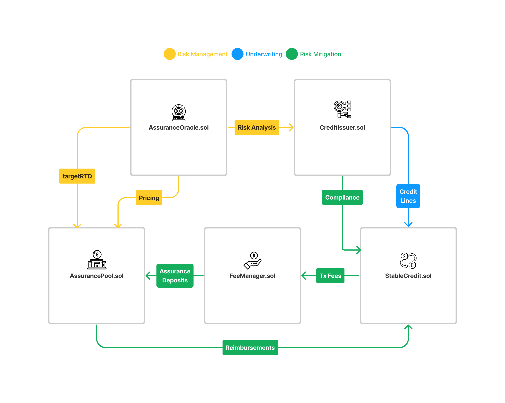

```
   _____       _____
  |  __ \     / ____|
  | |__) |___| (___   ___  _   _ _ __ ___ ___
  |  _  // _ \\___ \ / _ \| | | | '__/ __/ _ \
  | | \ \  __/____) | (_) | |_| | | | (_|  __/
  |_|  \_\___|_____/ \___/ \__,_|_|  \___\___|
```

# 𐄷 ReSource Stable Credit

**Stable Credits** are decentralized complementary currencies within on-chain mutual credit networks. For more information on the properties and advantages of mutual credit clearing, visit our [docs](https://www.blog.resource.finance/chapter-1-what-is-mutual-credit).

The main problem most mutual credit networks face is achieving sustainable stability at scale. To address this problem, **Stable Credit** networks rely on the [**ReSource Risk Management**](https://github.com/ReSource-Network/risk-management) infrastructure to analyze and mitigate credit risks.

📕 For more information on **ReSource Risk Management** check out our [docs](https://github.com/ReSource-Network/risk-management).

## Protocol Overview

---

The following diagram depicts how **Stable Credit** networks interact with the **ReSource Risk Management** protocol to stabilize their credit currencies.


---

## Contracts:

- **`StableCredit.sol`**: An extension of the base `MutualCredit.sol` and `ERC20.sol` contracts responsible for managing positive and negative balances of network members.
- **`FeeManager.sol`**: Responsible for collecting and distributing fees collected from **Stable Credit** transactions.
- **`AccessManager.sol`**: Responsible for role based access control of **Stable Credit** networks.

# 🏄‍♂️ Quick Start

This project uses [Foundry](https://github.com/foundry-rs/foundry) as the development framework and [Hardhat](https://github.com/NomicFoundation/hardhat) for the deployment framework.

####Dependencies

```bash
forge install
```

####Compilation

```bash
forge build
```

####Testing

```bash
forge test
```
